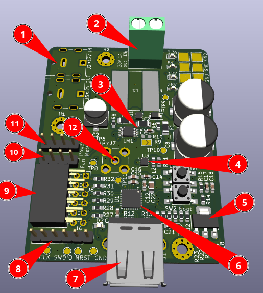

# USBADC
Le USBADC est un petit PCB qui implémente plusieurs fonctionnalités:
+ Lecture de la tension de sortie du power meter
+ Lecture de la température ambiante
+ Communication USB pour interfacer avec un ordinateur
+ Génération de 28 volts 1 ampère à partir de 12 volts 3 Ampères pour l'amplificateur RF
+ Génération de 5 volts pour le power meter
+ Contrôlle de la vitesse du ventilateur pour évacuer la chaleur
+ 6 sorties open-drain pour pouvoir controller des appareils nécessitant de la puissance (`PB1`, `PB3`, `PB4`, `PB5`, `PB6`, `PB7`)
+ 6 sorties digitales 3.3 volts pour du contrôlle ne nécessitant pas de puissance (`PA3`, `PA4`, `PA5`, `PA6`, `PA7`, `PA8`)
+ LED de statut du PCB, `D2` clignote lorsque le micro-contrôlleur n'a pas d'erreurs, et 4 autres LEDs indiquent si les générateurs de tensions fonctionnent (3.3V, 5V, 12V, 28V)

## Hardware
KiCad 10.0 a été utilisé pour la conception du schématique et du PCB.

### Composantes

1. Entré 12V 3A
2. Sortie 28V 1A
3. Boost 12V -> 28V
4. Buck 12V -> 5V
5. Régulateur 5V -> 3.3V
6. STM32U073K8U6
7. Connecteur USB A femelle
8. Connecteur SWD (Single Wire Debug)
9. Sorties open-drain et low power
10. Sortie PWM pour fan
11. Sortie pour alimentation du powermeter et entrée de la température
12. Entrée pour lecture de la puissance RF

### Programmation
Pour envoyer un programme sur le micro-contrôlleur, il y a le port USB ainsi qu'un port SWD près du connecteur USB (header 6 pins).
Pour le flasher par USB, il faut utiliser le périphérique DFU (Download Firmware Upgrade) qu'expose le bootloader to STM32. Par contre, je ne sais pas pourquoi, je n'ai pas été capable de le faire fonctionner plus qu'une seule fois.

Pour le flasher par SWD, il faut un STlink. J'ai utilisé un [STlink-V3MINIE](https://www.st.com/en/development-tools/stlink-v3minie.html) auquel j'avais accès, il serait peut-être pertinent de s'en achter un. J'ai aussi utilisé [stlink-tools](https://github.com/stlink-org/stlink) pour envoyer le programme. Il faut brancher:

| stlink | PCB   |
|:------:|:-----:|
| VCC    | VDD1  |
| CLK    | SWCLK |
| GND    | GND   |
| TMS    | SWDIO |
| RST    | NRST  |


### USB
La communication USB est faites avec un `STM32U073K8U6`, un micro-contrôlleur peu coûteux. C'est le moins cher qui a toutes les fonctionnalitées voulues, l'horloge pour le USB est générée à l'interne du chip.

### Génération 28V et 5V
Les bucks et boosts ont été générées avec l'outil [WEBENCH](https://webench.ti.com/power-designer/switching-regulator?powerSupply=0) de Texas Instrument pour être sûr que les circuits fonctionnent, jusqu'à maintenant, il n'y a eu aucuns problèmes.

### Sécurité
Pour la génération du 28V, il y a ~28 watts qui transitent dans cette partie du circuit. Il y a une fuse 4 ampères `F2` à l'entrée 12V du circuit et une fuse 1.5 ampères `F1` à la sortie 28V. De plus, il y a une diode schottky à la sortie 28V pour éviter d'envoyer des pics de tensions à l'amplificateur. Il y a aussi des condensateurs de capacitance équivalente 110µF pour lisser la tension entrante dans l'amplificateur.

Il y a des points de tests un peu partout sur le PCB pour être capable de débugger plus facilement si il arrive un problème.

### Boutons
Le PCB possède deux boutons, `BOOT0` et `Reset`.

`Reset` permet de redémarrer le microcontrôlleur, pratique pour débugger ou pour le redémarrer si il ne répond pas.
`BOOT0` permet de signaler au bootloader du microcontrôlleur que l'on désire flasher un programme pour qu'il expose la classe `DFU`. Il faut simplement tenir le bouton en appuyant sur `Reset`. Comme mentionné plus tôt, je ne comprends pas pourquoi je n'arrive pas à faire fonctionner cette option.

### Corrections à apporter sur une version future
Les connecteurs pour le ventilateur et le power meter overlap et ne peuvent donc pas être soudés directement sur le PCB.
Trouver pourquoi la programmation par DFU ne fonctionne pas et régler le problème.
Il m'est arrivé une fois que le board ne voulait pas démarrer, j'ai trouvé qu'il s'exposait comme périphérique DFU au démarage au lieu de CDC ACM et je n'étais pas capable de le faire booter plus loin que le bootloader. Je l'ai reflashé et ça a fonctionné, je n'ai pas revu ça depuis.
Mettre un connecteur USB mâle à la place d'un connecteur USB femelle car les connecteurs femelles sont réservés aux hôtes USB et les mâles aux périphériques.

## Firmware
La grande majorité du code dans `firmware/` a été générée avec `STM32CubeMX`, un outil pour initialiser des projets pour des STM32, ils s'occupent d'initialiser toutes les périphériques, vérifier que la configuration de clocks choisie est correcte, etc.
h

Le coeur de la logique a été implémentée dans `firmware/USBX/App/` en C.

### Compilation
Pour compiler le programme, il suffit d'écrire `make` si la toolchain de développement `arm` est installée. Je développais sur un ordinateur Linux et je roulais souvant 
```
make -j4; st-flash erase; st-flash write build/USBADC.bin 0x08000000
```
pour compiler et puis envoyer le programme sur le microcontrôlleur. Je ne suis pas certain que les `Makefile` sont supportés dans `STM32CubeIDE` (IDE de développement pour un STM32 installée sur l'ordinateur du laboratoire), je vais essayer de regarder ça pour que ça compile sur l'ordi du labo.

J'ai utilisé la "Arm GNU Toolchain 15.2.Rel1 (Build arm-15.86)) 15.2.1 20251203". Tout fonctionne avec celle là, il n'y a surement pas de soucis à prendre une autre version.

### Débuggage
Pour débugger, `STM32CubeIDE` et `stlink-tools` permettent d'ouvrir une session `gdb` et d'explorer la mémoire du microcontrolleur. Avec `stlink-tools`, je roulais dans un terminal `st-util` et dans l'autre `gdb build/USBADC.elf`, puis dans la session gdb `target remote localhost:4242`.

### Connection USB
Le périphérique USB crée expose une classe USB CDC ACM, (Character Device Class, Abstract Control Modem). Cette classe permet d'envoyer une série d'octet à l'appareil ainsi que d'en recevoir une. Lorsque branchée dans un ordinateur, le PCB devrait apparaître comme `/dev/ttyUSB*` sur Linux et `COM*` sur Windows. La LED devrait aussi clignotée si le microcontrôlleur est alimentée correctement et qu'il n'y a pas d'erreurs.

### Protocole de communication
La communication se produit par paquets entre le serveur (l'ordinateur) et le client (l'USBADC).
Un packet est une liste d'octets qui représente une commande ou une réponse. Le préfixe `0x` dénote de l'hexadécimale.

| Bytes       | Name        | Type      | Description                              |
|-------------|-------------|-----------|------------------------------------------|
| `0-3`       | Magic       | `u8[4]`   | `0xAA` `0x55` `0xAA` `0x55`              |
| `4-5`       | ID          | `u16`     | Request/response identifier.             |
| `6`         | Type        | `u8`      | Message type.                            |
| `7`         | Data Length | `u8`      | Bytes following this field.              |
| `8..7+N`    | Data        | `u8[]`    | Type-specific payload.                   |
| `8+N..11+N` | CRC         | `u32`     | Packet checksum using CRC32.             |

Le champs `Magic` permet d'identifier le début d'un paquet. `0xAA55AA55` a été choisi car c'est une séquence qui a peu de chance d'arriver avec du bruit ou dans des données, aussi, en binaire, les bits de 0xAA et 0x55 alternent et ça permet de reconnaitre à l'oeil le début de la séquence.

Le champs `ID` permet à l'USBADC de spécifier à quel paquet il répond en spécifiant l'ID du message qu'il a reçu dans sa réponse. Cela permet de répondre aux paquets dans un ordre différent de celui dans lequel ils ont été reçues si besoin.

Le champs `Type` est le type du message (ping, read_adc, write_pin, reboot, ...) et permet de spécifier comment interpréter les données,

Le champs `Data Length` est la longeur du champs `Data` en octets

Le champs `Data` est les données associées au `Type` choisi.

Le champs `CRC` (Cyclical Redundancy Checksum) sert à vérifier l'intégrité des données reçues. Lors de la réception d'un paquet, on calcule le checksum de tous les octets précédents. Si le checksum est identique à celui reçue, on peut être confiant qu'il n'y a pas eu d'erreur de transmission.

Le protocole est ses fonctions de sérialisation/désérialisation sont spécifiées dans `firmware/USBX/App/protocol.h` et `firmware/USBX/App/protocol.c`.
Les structures qui représentent les données transmises ont l'attribut `__attribute__((packed))` pour éviter les champs de "padding". Cet attribute garanti qu'il n'y en aura pas.


Sur le message `REQUEST_PING`, le client répond avec le message `RESPONSE_PONG` avec les mêmes données. Cela permet de s'assurer que le client fonctionne correctement.

Sur le message `REQUEST_READ_ADC`, le client répond avec `RESPONSE_READ_ADC` la tension lue sur le channel correspondant.

Sur le mesasge `REQUEST_WRITE_PIN`, le client répond avec `RESPONSE_STATUS` et sort l'état demandée sur la pin demandée.

Sur le mesasge `REQUEST_REBOOT`, le client répond avec `RESPONSE_STATUS` et redémarre (la communication sera coupée).

Sur le message `REQUEST_VERSION`, le client répond avec la version du protocole qu'il utilise. Cela permet de s'assurer que le client et le serveur sont sur la même version et que toutes les fonctionnalitées sont fonctionelles et supportées des deux côtés.

Sur tous les messages, le client peut répondre avec `RESPONSE_STATUS` et spécifier la raison (`enum USBADC_PROTOCOL_RESPONS_STATUS_REASONS`).

### Fichiers (`firmware/USBX/App/`)
+ `app_usbx_device.c`: Point d'entrée `ThreadX` qui initialise les tâches et le périphérique USB et les files.
+ `ux_device_cdc_acm.c`: Définitions de toutes les tâches concurrentes qui roulent, dont l'écriture et la lecture sur le canal USB, la lecture de l'ADC et le contrôle de la vitesse du ventilateur.
+ `byte_vector.c`: Définition des fonctions pour manipuler une liste d'octets qui ne peut pas être agrandie.
+ `protocol.c`: Définition des fonctions pour sérialiser/désérialiser les packets envoyées/reçues


## Software
Python 3.11 a été utilisé.

Dans `software/USBADC.py`, il y a la classe `USBADC` qui permet de communiquer avec le périphérique. Il est nécessaire d'installer `pyserial` pour être capable de communiquer.
